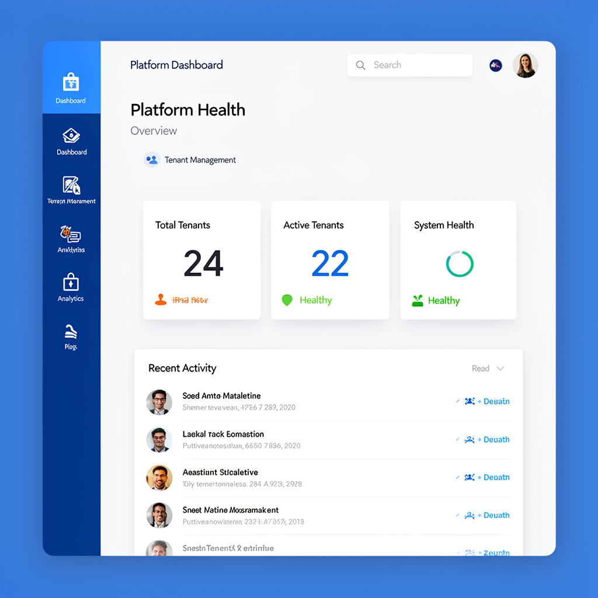
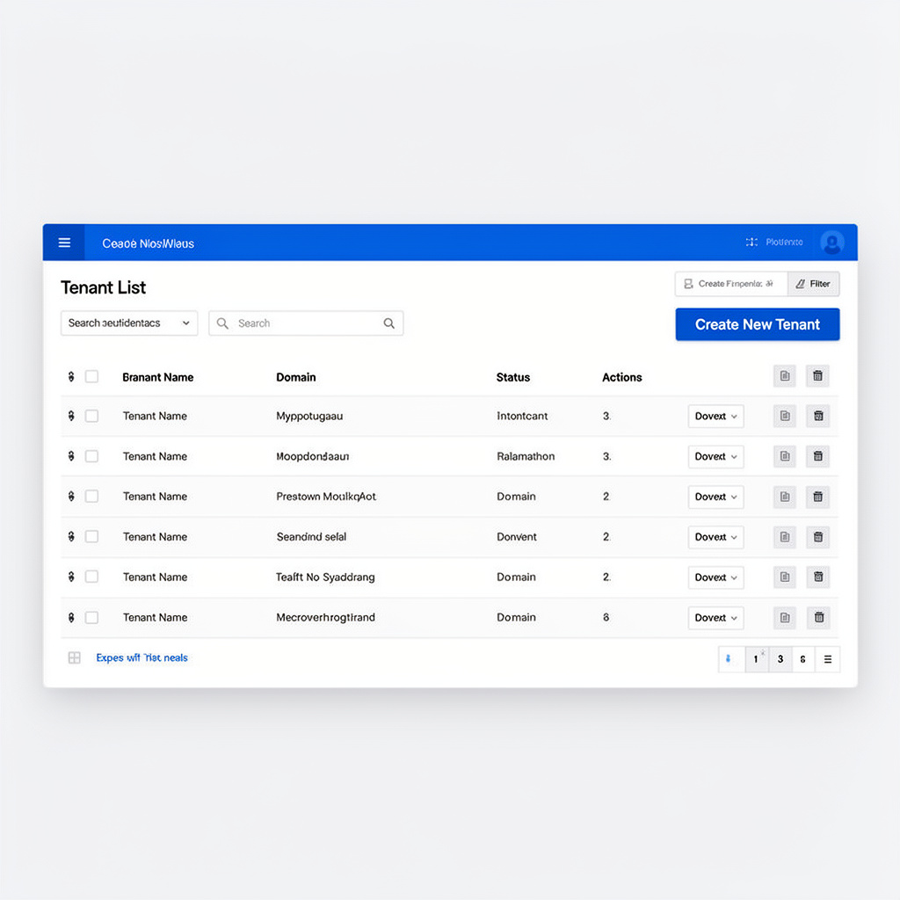
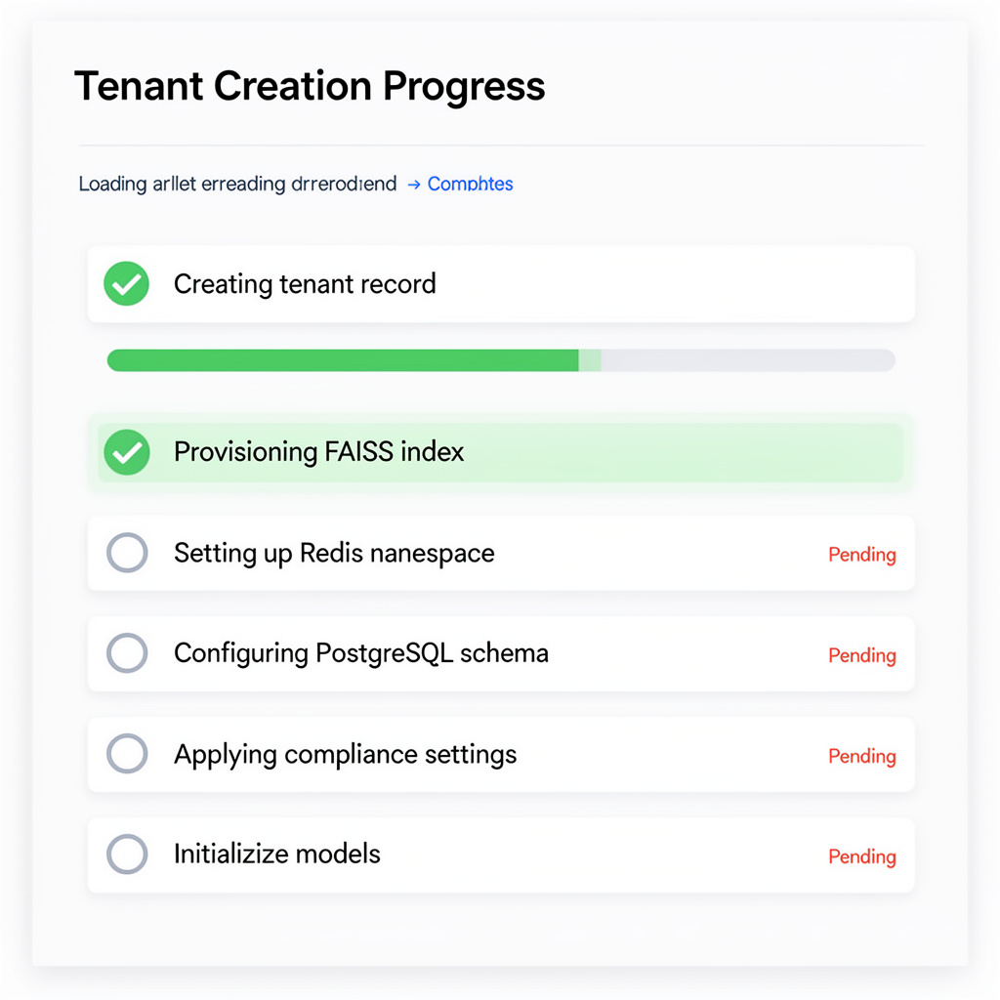
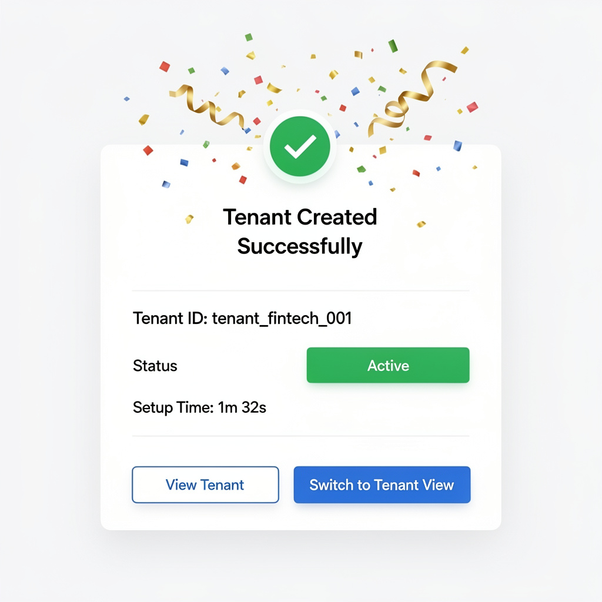
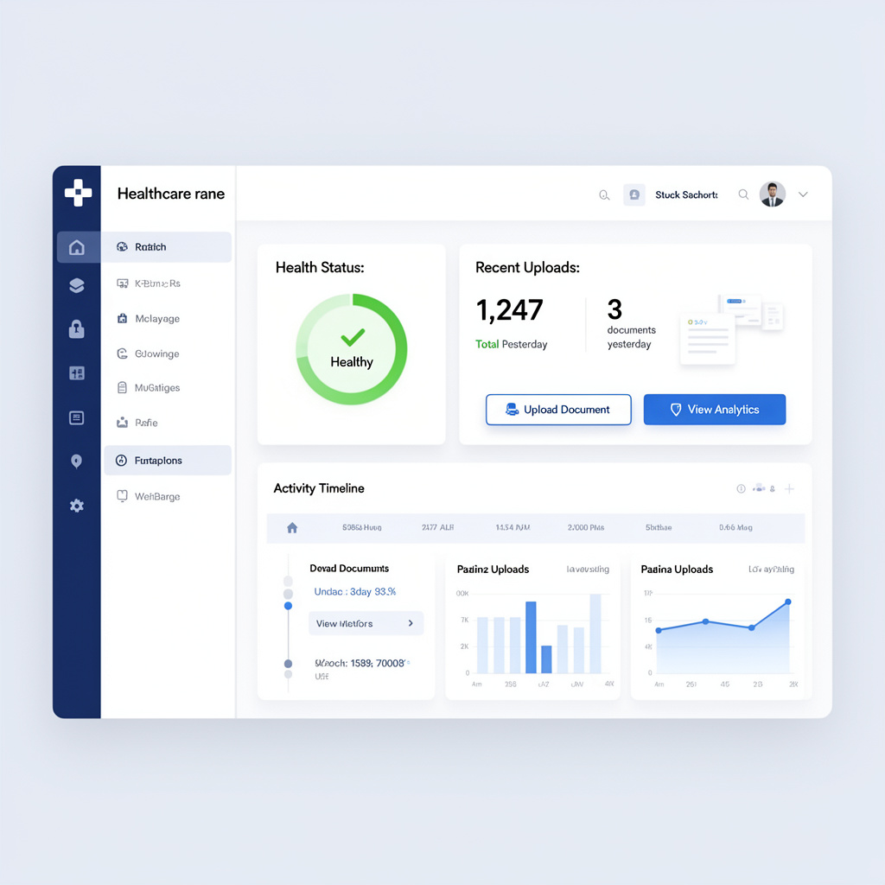
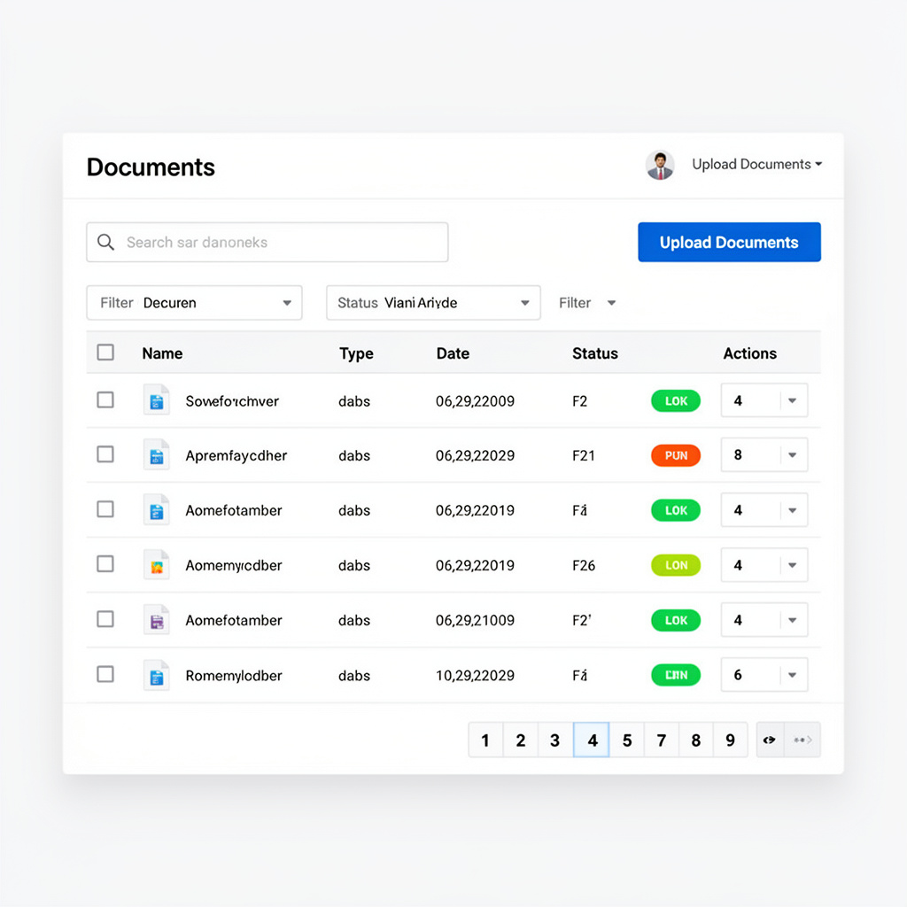
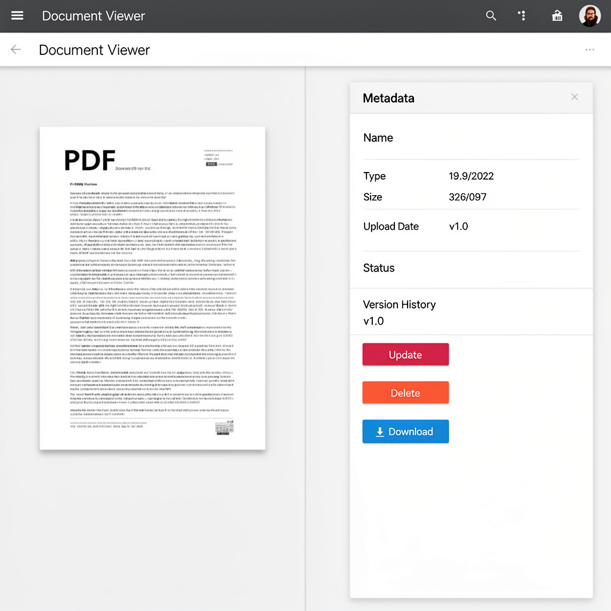
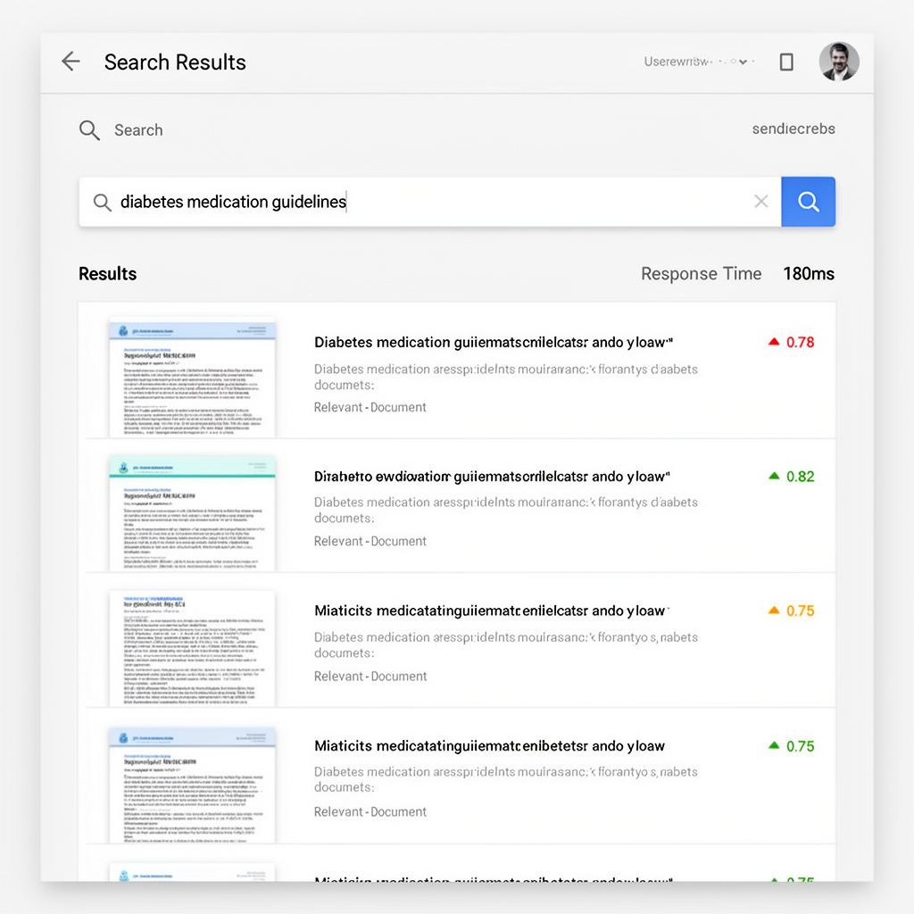

# Admin UI User Journey Maps

**Document Type**: User Journey Maps  
**Date**: 2026-01-04  
**Author**: Sally (UX Designer)  
**Status**: Enhanced with Visual Mockups  
**Last Updated**: 2026-01-08

---

## Overview

This document provides detailed user journey maps for the three primary admin personas of the FAISS-RAG System Admin UI. Each journey map visualizes the user's experience, emotions, touchpoints, and pain points throughout their interaction with the system.

**Visual Mockups**: This document has been enhanced with high-fidelity UI mockups generated using the genImage MCP server. Each key touchpoint in the journeys now includes visual representations to help stakeholders understand the user experience.

**Mockup Location**: All visual mockups are stored in `_bmad-output/planning-artifacts/journey-mockups/` organized by persona journey.

---

## Journey Map 1: Alex Chen - Uber Admin Onboarding New Tenant

### Persona Context
- **Name**: Alex Chen
- **Role**: Platform Operator / Uber Admin
- **Goal**: Onboard a new fintech tenant in under 5 minutes
- **Context**: New tenant signed up, needs immediate setup

### Journey Stages

```
┌─────────────────────────────────────────────────────────────────────────┐
│ JOURNEY MAP: Uber Admin - Tenant Onboarding                            │
├─────────────────────────────────────────────────────────────────────────┤
│                                                                         │
│  STAGE 1: Login & Platform Overview                                    │
│  ┌─────────────────────────────────────────────────────────────────┐  │
│  │ Touchpoint: Login Page                                          │  │
│  │ Action: Alex logs in with OAuth credentials                      │  │
│  │ Emotion: 😊 Confident - knows the system well                    │  │
│  │ Pain Point: None - familiar process                              │  │
│  │                                                                  │  │
│  │ Touchpoint: Platform Dashboard                                   │  │
│  │ Action: Views platform health, sees new tenant request           │  │
│  │ Emotion: 😊 Focused - ready to work                              │  │
│  │ Pain Point: None                                                 │  │
│  │                                                                  │  │
│  │ 📸 **Visual Mockup**:                                          │  │
│  │  │  │
│  └─────────────────────────────────────────────────────────────────┘  │
│                                                                         │
│  STAGE 2: Navigate to Tenant Management                                │
│  ┌─────────────────────────────────────────────────────────────────┐  │
│  │ Touchpoint: Navigation Sidebar                                   │  │
│  │ Action: Clicks "Tenant Management"                              │  │
│  │ Emotion: 😊 Efficient - clear navigation                        │  │
│  │ Pain Point: None                                                 │  │
│  │                                                                  │  │
│  │ Touchpoint: Tenant List Page                                    │  │
│  │ Action: Views list of all tenants, sees "Create New Tenant" btn │  │
│  │ Emotion: 😊 Ready - knows what to do                             │  │
│  │ Pain Point: None                                                 │  │
│  │                                                                  │  │
│  │ 📸 **Visual Mockup**:                                          │  │
│  │  │  │
│  └─────────────────────────────────────────────────────────────────┘  │
│                                                                         │
│  STAGE 3: Create New Tenant (Multi-Step Wizard)                        │
│  ┌─────────────────────────────────────────────────────────────────┐  │
│  │ STEP 1: Basic Information                                       │  │
│  │ Touchpoint: Tenant Creation Wizard - Step 1                      │  │
│  │ Action: Enters tenant name, domain (fintech), contact info      │  │
│  │ Fields:                                                          │  │
│  │   - Tenant Name: "FinTech Solutions Inc"                        │  │
│  │   - Domain: [Dropdown] Fintech                                  │  │
│  │   - Contact Email: admin@fintechsolutions.com                  │  │
│  │   - Contact Phone: +1-555-0123                                  │  │
│  │ Emotion: 😊 Efficient - form is clear and simple                │  │
│  │ Pain Point: None                                                 │  │
│  │                                                                  │  │
│  │ 📸 **Visual Mockup**:                                          │  │
│  │  │  │
│  │                                                                  │  │
│  │ STEP 2: Template Selection                                      │  │
│  │ Touchpoint: Tenant Creation Wizard - Step 2                      │  │
│  │ Action: Selects "Fintech Template" from available templates    │  │
│  │ UI Elements:                                                     │  │
│  │   - Template Cards with preview                                 │  │
│  │   - Template details (compliance, models, settings)             │  │
│  │   - "Preview Template" button                                   │  │
│  │ Emotion: 😊 Confident - template makes setup faster              │  │
│  │ Pain Point: None - templates are well-documented                │  │
│  │                                                                  │  │
│  │ STEP 3: Initial Configuration                                   │  │
│  │ Touchpoint: Tenant Creation Wizard - Step 3                      │  │
│  │ Action: Reviews pre-filled settings from template, adjusts if   │  │
│  │         needed                                                   │  │
│  │ Settings:                                                        │  │
│  │   - Compliance: PCI DSS (pre-selected)                          │  │
│  │   - Embedding Model: text-embedding-ada-002 (pre-selected)      │  │
│  │   - Rate Limit: 1000/min (default)                              │  │
│  │   - Storage Quota: 10GB (default)                               │  │
│  │ Emotion: 😊 Satisfied - template handles most config             │  │
│  │ Pain Point: None - can customize if needed                      │  │
│  │                                                                  │  │
│  │ STEP 4: Review & Create                                        │  │
│  │ Touchpoint: Tenant Creation Wizard - Step 4                      │  │
│  │ Action: Reviews summary, clicks "Create Tenant"                │  │
│  │ Summary Shows:                                                   │  │
│  │   - Tenant name and domain                                      │  │
│  │   - Template used                                               │  │
│  │   - Key settings                                                │  │
│  │   - Estimated setup time: < 2 minutes                           │  │
│  │ Emotion: 😊 Confident - ready to create                         │  │
│  │ Pain Point: None                                                 │  │
│  └─────────────────────────────────────────────────────────────────┘  │
│                                                                         │
│  STAGE 4: Tenant Creation & Verification                               │
│  ┌─────────────────────────────────────────────────────────────────┐  │
│  │ Touchpoint: Creation Progress Indicator                          │  │
│  │ Action: Watches progress as system creates tenant               │  │
│  │ Progress Steps:                                                  │  │
│  │   ✓ Creating tenant record                                     │  │
│  │   ✓ Provisioning FAISS index                                    │  │
│  │   ✓ Setting up Redis namespace                                 │  │
│  │   ✓ Configuring PostgreSQL schema                              │  │
│  │   ✓ Applying compliance settings                               │  │
│  │   ✓ Initializing models                                        │  │
│  │ Emotion: 😊 Patient - progress is clear                         │  │
│  │ Pain Point: None - progress feedback is helpful                  │  │
│  │                                                                  │  │
│  │ 📸 **Visual Mockup**:                                          │  │
│  │  │  │
│  │                                                                  │  │
│  │ Touchpoint: Success Confirmation                                 │  │
│  │ Action: Sees "Tenant Created Successfully" message              │  │
│  │ Success Message Shows:                                          │  │
│  │   - Tenant ID: tenant_fintech_001                               │  │
│  │   - Status: Active                                              │  │
│  │   - Setup Time: 1m 32s                                          │  │
│  │   - Actions: "View Tenant" | "Switch to Tenant View"           │  │
│  │ Emotion: 😊 Satisfied - completed in under 2 minutes            │  │
│  │ Pain Point: None                                                 │  │
│  │                                                                  │  │
│  │ 📸 **Visual Mockup**:                                          │  │
│  │  │  │
│  └─────────────────────────────────────────────────────────────────┘  │
│                                                                         │
│  STAGE 5: Verify Tenant Setup (Optional)                               │
│  ┌─────────────────────────────────────────────────────────────────┐  │
│  │ Touchpoint: Tenant Details Page                                  │  │
│  │ Action: Clicks "View Tenant" to verify setup                     │  │
│  │ Views:                                                           │  │
│  │   - Tenant information                                          │  │
│  │   - Health status: Healthy                                      │  │
│  │   - Configuration summary                                       │  │
│  │   - Quick stats (0 documents, 0 users)                          │  │
│  │ Emotion: 😊 Confident - everything looks good                   │  │
│  │ Pain Point: None                                                 │  │
│  │                                                                  │  │
│  │ Touchpoint: "Switch to Tenant View" Button                      │  │
│  │ Action: Clicks to see tenant from tenant admin perspective     │  │
│  │ Result: UI switches to Tenant Admin view for this tenant         │  │
│  │ Banner: "🔧 Uber Admin Mode - Viewing: FinTech Solutions Inc"  │  │
│  │ Emotion: 😊 Satisfied - can verify tenant experience            │  │
│  │ Pain Point: None                                                 │  │
│  └─────────────────────────────────────────────────────────────────┘  │
│                                                                         │
│  OUTCOME: ✅ Tenant onboarded successfully in 1m 32s (< 5 min target) │
│  EMOTION: 😊 Satisfied and efficient                                  │
└─────────────────────────────────────────────────────────────────────────┘
```

### Key Insights
- **Total Time**: ~2 minutes (well under 5-minute target)
- **Pain Points**: None identified - smooth flow
- **Success Factors**: Template-based setup, clear progress indicators, verification options
- **Emotional Arc**: Confident → Focused → Efficient → Satisfied

---

## Journey Map 2: Lisa Thompson - Tenant Admin Managing Documents

### Persona Context
- **Name**: Lisa Thompson
- **Role**: Healthcare Tenant Administrator
- **Goal**: Upload new medical guidelines and update existing documents
- **Context**: New HIPAA guidelines released, needs to update knowledge base

### Journey Stages

```
┌─────────────────────────────────────────────────────────────────────────┐
│ JOURNEY MAP: Tenant Admin - Document Management                        │
├─────────────────────────────────────────────────────────────────────────┤
│                                                                         │
│  STAGE 1: Login & Tenant Dashboard                                     │
│  ┌─────────────────────────────────────────────────────────────────┐  │
│  │ Touchpoint: Login Page                                          │  │
│  │ Action: Lisa logs in with healthcare tenant credentials         │  │
│  │ Emotion: 😊 Familiar - uses system regularly                   │  │
│  │ Pain Point: None                                                 │  │
│  │                                                                  │  │
│  │ Touchpoint: Tenant Dashboard                                    │  │
│  │ Action: Views dashboard, sees document count, recent activity    │  │
│  │ Dashboard Shows:                                                │  │
│  │   - Health Status: Healthy ✅                                   │  │
│  │   - Total Documents: 1,247                                      │  │
│  │   - Recent Uploads: 3 documents yesterday                       │  │
│  │   - Quick Actions: Upload Document, View Analytics              │  │
│  │ Emotion: 😊 Informed - knows current state                      │  │
│  │ Pain Point: None                                                 │  │
│  │                                                                  │  │
│  │ 📸 **Visual Mockup**:                                          │  │
│  │  │  │
│  └─────────────────────────────────────────────────────────────────┘  │
│                                                                         │
│  STAGE 2: Navigate to Document Management                              │
│  ┌─────────────────────────────────────────────────────────────────┐  │
│  │ Touchpoint: Navigation Sidebar                                   │  │
│  │ Action: Clicks "Document Management"                            │  │
│  │ Emotion: 😊 Efficient - clear navigation                        │  │
│  │ Pain Point: None                                                 │  │
│  │                                                                  │  │
│  │ Touchpoint: Document List Page                                  │  │
│  │ Action: Views list of all documents                            │  │
│  │ List Shows:                                                      │  │
│  │   - Table with columns: Name, Type, Date, Status, Actions      │  │
│  │   - Search bar at top                                          │  │
│  │   - Filter options (Type, Status, Date Range)                  │  │
│  │   - "Upload Documents" button (prominent)                      │  │
│  │   - Pagination (50 per page)                                   │  │
│  │ Emotion: 😊 Organized - can find what she needs                │  │
│  │ Pain Point: None                                                 │  │
│  │                                                                  │  │
│  │ 📸 **Visual Mockup**:                                          │  │
│  │  │  │
│  └─────────────────────────────────────────────────────────────────┘  │
│                                                                         │
│  STAGE 3: Upload New Documents                                         │
│  ┌─────────────────────────────────────────────────────────────────┐  │
│  │ Touchpoint: "Upload Documents" Button                           │  │
│  │ Action: Clicks to open upload dialog                           │  │
│  │ Emotion: 😊 Ready - knows what to upload                        │  │
│  │ Pain Point: None                                                 │  │
│  │                                                                  │  │
│  │ Touchpoint: Upload Dialog                                       │  │
│  │ Action: Drags and drops 3 PDF files (new HIPAA guidelines)    │  │
│  │ Upload Interface:                                               │  │
│  │   - Large drag-and-drop zone                                   │  │
│  │   - "Browse Files" button                                      │  │
│  │   - File list showing:                                         │  │
│  │     • HIPAA_Guidelines_2024.pdf (2.3 MB)                       │  │
│  │     • Medical_Forms_Update.pdf (1.8 MB)                        │  │
│  │     • Compliance_Checklist.pdf (950 KB)                       │  │
│  │   - File type validation (shows checkmarks)                    │  │
│  │   - "Upload" button                                            │  │
│  │ Emotion: 😊 Confident - interface is intuitive                 │  │
│  │ Pain Point: None                                                 │  │
│  │                                                                  │  │
│  │ 📸 **Visual Mockup**:                                          │  │
│  │  │  │
│  │                                                                  │  │
│  │ Touchpoint: Upload Progress                                     │  │
│  │ Action: Clicks "Upload", watches progress                      │  │
│  │ Progress Shows:                                                 │  │
│  │   - Individual file progress bars                             │  │
│  │   - Status: Uploading → Processing → Indexing → Complete      │  │
│  │   - Time estimates for each stage                              │  │
│  │   - Can minimize and continue working                          │  │
│  │ Emotion: 😊 Patient - progress is clear                        │  │
│  │ Pain Point: None - can work while files process                │  │
│  │                                                                  │  │
│  │ 📸 **Visual Mockup**:                                          │  │
│  │  │  │
│  │                                                                  │  │
│  │ Touchpoint: Upload Complete Notification                       │  │
│  │ Action: Receives notification when all files are indexed       │  │
│  │ Notification:                                                   │  │
│  │   ✓ 3 documents uploaded and indexed successfully              │  │
│  │   - View Documents button                                      │  │
│  │ Emotion: 😊 Satisfied - upload completed successfully          │  │
│  │ Pain Point: None                                                 │  │
│  └─────────────────────────────────────────────────────────────────┘  │
│                                                                         │
│  STAGE 4: Update Existing Document                                     │
│  ┌─────────────────────────────────────────────────────────────────┐  │
│  │ Touchpoint: Document List                                       │  │
│  │ Action: Searches for "Patient_Intake_Form"                     │  │
│  │ Search: Types in search bar, filters results                   │  │
│  │ Emotion: 😊 Efficient - search works well                      │  │
│  │ Pain Point: None                                                 │  │
│  │                                                                  │  │
│  │ Touchpoint: Document Row Actions                                │  │
│  │ Action: Clicks "View" on Patient_Intake_Form.pdf                │  │
│  │ Emotion: 😊 Focused - ready to review                           │  │
│  │ Pain Point: None                                                 │  │
│  │                                                                  │  │
│  │ Touchpoint: Document Viewer                                     │  │
│  │ Action: Views document, sees "Update" button                    │  │
│  │ Viewer Shows:                                                   │  │
│  │   - Document preview (PDF viewer)                              │  │
│  │   - Metadata: Name, Type, Size, Upload Date, Status            │  │
│  │   - Version History: v1.0 (current), v0.9, v0.8                │  │
│  │   - Actions: Update, Delete, Download                          │  │
│  │ Emotion: 😊 Informed - can see document details                │  │
│  │ Pain Point: None                                                 │  │
│  │                                                                  │  │
│  │ 📸 **Visual Mockup**:                                          │  │
│  │  │  │
│  │                                                                  │  │
│  │ Touchpoint: Update Document Dialog                              │  │
│  │ Action: Clicks "Update", uploads new version                    │  │
│  │ Update Interface:                                               │  │
│  │   - "Select New File" button                                   │  │
│  │   - Selected: Patient_Intake_Form_v2.pdf                       │  │
│  │   - Version notes field (optional)                             │  │
│  │   - "Update Document" button                                   │  │
│  │   - Info: "Previous version will be preserved"                │  │
│  │ Emotion: 😊 Confident - update process is clear                 │  │
│  │ Pain Point: None                                                 │  │
│  │                                                                  │  │
│  │ Touchpoint: Update Confirmation                                  │  │
│  │ Action: Sees confirmation that document was updated             │  │
│  │ Confirmation:                                                   │  │
│  │   ✓ Document updated successfully                              │  │
│  │   - New version: v2.0                                          │  │
│  │   - Previous version: v1.0 (preserved)                         │  │
│  │   - Status: Processing → Indexing → Complete                  │  │
│  │ Emotion: 😊 Satisfied - update completed                        │  │
│  │ Pain Point: None                                                 │  │
│  └─────────────────────────────────────────────────────────────────┘  │
│                                                                         │
│  STAGE 5: Verify Documents Are Searchable                               │
│  ┌─────────────────────────────────────────────────────────────────┐  │
│  │ Touchpoint: Document List                                       │  │
│  │ Action: Filters to see newly uploaded documents                │  │
│  │ Filter: "Uploaded Today"                                      │  │
│  │ Result: Shows 4 documents (3 new + 1 updated)                 │  │
│  │ All show Status: ✅ Indexed                                    │  │
│  │ Emotion: 😊 Confident - all documents are ready                │  │
│  │ Pain Point: None                                                 │  │
│  │                                                                  │  │
│  │ Touchpoint: Quick Test Search (Optional)                        │  │
│  │ Action: Uses test search feature to verify documents           │  │
│  │ Test Search: "HIPAA guidelines 2024"                           │  │
│  │ Result: Returns HIPAA_Guidelines_2024.pdf in results           │  │
│  │ Emotion: 😊 Satisfied - documents are searchable               │  │
│  │ Pain Point: None                                                 │  │
│  └─────────────────────────────────────────────────────────────────┘  │
│                                                                         │
│  OUTCOME: ✅ Documents uploaded and updated successfully               │
│  EMOTION: 😊 Satisfied and efficient                                  │
└─────────────────────────────────────────────────────────────────────────┘
```

### Key Insights
- **Total Time**: ~5-7 minutes for upload and update
- **Pain Points**: None identified - intuitive flow
- **Success Factors**: Drag-and-drop, clear progress, version history, search verification
- **Emotional Arc**: Familiar → Efficient → Confident → Satisfied

---

## Journey Map 3: Pat Williams - Support Troubleshooter Investigating Issue

### Persona Context
- **Name**: Pat Williams
- **Role**: Support Engineer / Troubleshooter
- **Goal**: Investigate and fix search accuracy issue for healthcare tenant
- **Context**: Tenant reports inaccurate search results, needs quick resolution

### Journey Stages

```
┌─────────────────────────────────────────────────────────────────────────┐
│ JOURNEY MAP: Support Troubleshooter - Issue Investigation               │
├─────────────────────────────────────────────────────────────────────────┤
│                                                                         │
│  STAGE 1: Receive Issue Report & Login                                  │
│  ┌─────────────────────────────────────────────────────────────────┐  │
│  │ Touchpoint: Support Ticket / Email                               │  │
│  │ Action: Receives ticket: "Search results inaccurate"            │  │
│  │ Ticket Info:                                                     │  │
│  │   - Tenant: Healthcare Solutions Inc                            │  │
│  │   - Issue: Low relevance scores on medical queries              │  │
│  │   - Priority: High                                              │  │
│  │ Emotion: 😟 Concerned - needs to investigate quickly            │  │
│  │ Pain Point: ⚠️ Unclear what's causing the issue                  │  │
│  │                                                                  │  │
│  │ Touchpoint: Login Page                                          │  │
│  │ Action: Logs in as Uber Admin                                   │  │
│  │ Emotion: 😊 Focused - ready to investigate                      │  │
│  │ Pain Point: None                                                 │  │
│  └─────────────────────────────────────────────────────────────────┘  │
│                                                                         │
│  STAGE 2: Switch to Tenant Context                                      │
│  ┌─────────────────────────────────────────────────────────────────┐  │
│  │ Touchpoint: Platform Dashboard                                  │  │
│  │ Action: Views platform overview, sees tenant in list           │  │
│  │ Emotion: 😊 Efficient - can see tenant status                  │  │
│  │ Pain Point: None                                                 │  │
│  │                                                                  │  │
│  │ Touchpoint: Tenant Management → Tenant List                     │  │
│  │ Action: Finds "Healthcare Solutions Inc" in tenant list         │  │
│  │ Action: Clicks "Switch to Tenant View"                         │  │
│  │ Emotion: 😊 Confident - knows how to access tenant             │  │
│  │ Pain Point: None                                                 │  │
│  │                                                                  │  │
│  │ Touchpoint: Context Switch Confirmation                          │  │
│  │ Action: UI switches to Tenant Admin view                       │  │
│  │ Banner: "🔧 Uber Admin Mode - Viewing: Healthcare Solutions Inc" │  │
│  │ Navigation: Now shows tenant-specific navigation               │  │
│  │ Emotion: 😊 Ready - can now investigate tenant-specific issues │  │
│  │ Pain Point: None                                                 │  │
│  │                                                                  │  │
│  │ 📸 **Visual Mockup**:                                          │  │
│  │  │  │
│  └─────────────────────────────────────────────────────────────────┘  │
│                                                                         │
│  STAGE 3: Investigate Tenant Configuration                             │
│  ┌─────────────────────────────────────────────────────────────────┐  │
│  │ Touchpoint: Tenant Dashboard                                    │  │
│  │ Action: Views tenant health and metrics                         │  │
│  │ Dashboard Shows:                                                │  │
│  │   - Health Status: ⚠️ Warning (search accuracy low)            │  │
│  │   - Search Analytics: Avg relevance score: 0.45 (low)          │  │
│  │   - Recent Activity: High search volume, low satisfaction       │  │
│  │ Emotion: 😟 Concerned - confirms the issue                     │  │
│  │ Pain Point: ⚠️ Need to find root cause                         │  │
│  │                                                                  │  │
│  │ Touchpoint: Configuration Page                                  │  │
│  │ Action: Navigates to "Configuration" → "Model Settings"         │  │
│  │ Configuration Shows:                                           │  │
│  │   - Embedding Model: text-embedding-ada-002 (generic)          │  │
│  │   - Domain: Healthcare (but model not optimized)                │  │
│  │   - Model Parameters: Default settings                          │  │
│  │ Emotion: 😟 Identifies potential issue - model not optimized   │  │
│  │ Pain Point: ⚠️ Generic model may not understand medical terms  │  │
│  │                                                                  │  │
│  │ 📸 **Visual Mockup**:                                          │  │
│  │  │  │
│  │                                                                  │  │
│  │ Touchpoint: Document Management                                 │  │
│  │ Action: Checks document ingestion history                      │  │
│  │ Document List Shows:                                            │  │
│  │   - Total Documents: 2,341                                      │  │
│  │   - Recent Uploads: 15 documents last week                      │  │
│  │   - Status Filter: Shows 3 documents with "Processing Error"    │  │
│  │ Emotion: 😟 Found another issue - some documents failed         │  │
│  │ Pain Point: ⚠️ Failed documents may affect search quality      │  │
│  └─────────────────────────────────────────────────────────────────┘  │
│                                                                         │
│  STAGE 4: Identify Root Causes                                         │
│  ┌─────────────────────────────────────────────────────────────────┐  │
│  │ Touchpoint: Analytics Page                                      │  │
│  │ Action: Views "Search Analytics" for detailed metrics           │  │
│  │ Analytics Show:                                                 │  │
│  │   - Query Performance Chart: Declining over last 7 days        │  │
│  │   - Top Queries: Medical terminology queries                   │  │
│  │   - Relevance Scores: Average 0.45 (target: >0.7)             │  │
│  │   - Error Rate: 3% (some queries failing)                      │  │
│  │ Emotion: 😟 Confirmed - multiple issues identified              │  │
│  │ Pain Point: ⚠️ Need to prioritize fixes                        │  │
│  │                                                                  │  │
│  │ 📸 **Visual Mockup**:                                          │  │
│  │  │  │
│  │                                                                  │  │
│  │ Touchpoint: Audit Logs (Optional)                               │  │
│  │ Action: Reviews recent configuration changes                    │  │
│  │ Logs Show:                                                      │  │
│  │   - Last model update: 30 days ago                              │  │
│  │   - Recent document uploads: Some failed processing            │  │
│  │   - No recent configuration changes                            │  │
│  │ Emotion: 😊 Clear - understands the issues now                 │  │
│  │ Pain Point: None - has enough information                       │  │
│  └─────────────────────────────────────────────────────────────────┘  │
│                                                                         │
│  STAGE 5: Apply Fixes                                                   │
│  ┌─────────────────────────────────────────────────────────────────┐  │
│  │ Touchpoint: Configuration → Model Settings                      │  │
│  │ Action: Updates embedding model to medical-optimized version    │  │
│  │ Update Process:                                                 │  │
│  │   1. Selects "text-embedding-3-large" (medical-optimized)      │  │
│  │   2. Adjusts model parameters for medical domain               │  │
│  │   3. Clicks "Save Configuration"                                │  │
│  │   4. Confirmation: "Model updated successfully"                 │  │
│  │   5. System message: "Re-indexing documents with new model..."  │  │
│  │ Emotion: 😊 Confident - fixing the main issue                   │  │
│  │ Pain Point: ⚠️ Re-indexing may take time                       │  │
│  │                                                                  │  │
│  │ Touchpoint: Document Management                                  │  │
│  │ Action: Re-uploads failed documents                             │  │
│  │ Process:                                                        │  │
│  │   1. Filters to "Processing Error" status                      │  │
│  │   2. Selects 3 failed documents                                │  │
│  │   3. Clicks "Re-process"                                        │  │
│  │   4. Documents re-enter processing queue                       │  │
│  │   5. Monitors until all show "Indexed" status                  │  │
│  │ Emotion: 😊 Satisfied - fixing document issues                 │  │
│  │ Pain Point: None - re-processing is straightforward            │  │
│  └─────────────────────────────────────────────────────────────────┘  │
│                                                                         │
│  STAGE 6: Verify Fix                                                    │
│  ┌─────────────────────────────────────────────────────────────────┐  │
│  │ Touchpoint: Test Search Feature                                  │  │
│  │ Action: Uses test search to verify improvements                │  │
│  │ Test Query: "diabetes medication guidelines"                   │  │
│  │ Results:                                                        │  │
│  │   - Returns relevant medical documents                         │  │
│  │   - Relevance scores: 0.78, 0.82, 0.75 (much improved!)        │  │
│  │   - Response time: 180ms (within target)                        │  │
│  │ Emotion: 😊 Satisfied - fix is working                          │  │
│  │ Pain Point: None                                                 │  │
│  │                                                                  │  │
│  │ 📸 **Visual Mockup**:                                          │  │
│  │  │  │
│  │                                                                  │  │
│  │ Touchpoint: Analytics Dashboard                                 │  │
│  │ Action: Monitors search analytics over next hour                │  │
│  │ Analytics Show:                                                 │  │
│  │   - Average relevance score: 0.76 (up from 0.45)               │  │
│  │   - Error rate: 0.5% (down from 3%)                            │  │
│  │   - User satisfaction: Improved                                │  │
│  │ Emotion: 😊 Confident - issue resolved                         │  │
│  │ Pain Point: None                                                 │  │
│  │                                                                  │  │
│  │ Touchpoint: Exit Tenant Context                                  │  │
│  │ Action: Clicks "Exit to Platform View"                          │  │
│  │ Action: Documents solution in support ticket                    │  │
│  │ Emotion: 😊 Satisfied - issue resolved and documented          │  │
│  │ Pain Point: None                                                 │  │
│  └─────────────────────────────────────────────────────────────────┘  │
│                                                                         │
│  OUTCOME: ✅ Issue identified and resolved                             │
│  EMOTION: 😊 Satisfied and confident                                  │
└─────────────────────────────────────────────────────────────────────────┘
```

### Key Insights
- **Total Time**: ~15-20 minutes for investigation and fix
- **Pain Points**: Initial uncertainty, need to investigate multiple areas
- **Success Factors**: Context switching, comprehensive analytics, test search, clear configuration UI
- **Emotional Arc**: Concerned → Focused → Investigating → Confident → Satisfied

---

## Journey Map Summary

### Common Patterns Across All Journeys

1. **Clear Navigation**: All users can easily find what they need
2. **Progress Feedback**: Users always know what's happening
3. **Context Awareness**: UI clearly shows current role and context
4. **Error Prevention**: Validation and confirmation prevent mistakes
5. **Efficient Workflows**: Multi-step processes are streamlined
6. **Verification Options**: Users can verify their actions worked

### Pain Points Identified

1. **Pat's Journey**: Initial uncertainty about root cause (mitigated by comprehensive analytics)
2. **Potential**: Re-indexing time after model changes (could show progress/ETA)

### Success Metrics

- **Alex (Uber Admin)**: Tenant onboarding < 5 minutes ✅
- **Lisa (Tenant Admin)**: Document upload/update < 10 minutes ✅
- **Pat (Support)**: Issue resolution < 30 minutes ✅

### Recommendations

1. **Add Progress Indicators**: For long-running operations (re-indexing)
2. **Add Help Tooltips**: For complex configurations
3. **Add Quick Actions**: Shortcuts for common tasks
4. **Add Search Everywhere**: Global search across all sections
5. **Add Notifications**: Real-time updates for background processes

---

**Next Steps**: Implementation epics and stories based on these journey maps and visual mockups.

---

## Visual Mockup Gallery

All visual mockups have been generated using the genImage MCP server (tenant_id="fedfina") and are organized by journey:

### Alex Chen - Uber Admin Journey (5 mockups)
1. **Platform Dashboard** - `journey-mockups/alex-journey/01-platform-dashboard.png`
2. **Tenant List Page** - `journey-mockups/alex-journey/02-tenant-list.png`
3. **Tenant Creation Wizard Step 1** - `journey-mockups/alex-journey/03-tenant-wizard-step1.png`
4. **Tenant Creation Progress** - `journey-mockups/alex-journey/04-tenant-progress.png`
5. **Tenant Success Confirmation** - `journey-mockups/alex-journey/05-tenant-success.png`

### Lisa Thompson - Tenant Admin Journey (5 mockups)
1. **Tenant Dashboard** - `journey-mockups/lisa-journey/01-tenant-dashboard.png`
2. **Document List Page** - `journey-mockups/lisa-journey/02-document-list.png`
3. **Upload Dialog** - `journey-mockups/lisa-journey/03-upload-dialog.png`
4. **Document Viewer** - `journey-mockups/lisa-journey/04-document-viewer.png`
5. **Upload Progress** - `journey-mockups/lisa-journey/05-upload-progress.png`

### Pat Williams - Support Troubleshooter Journey (4 mockups)
1. **Context Switcher** - `journey-mockups/pat-journey/01-context-switcher.png`
2. **Configuration Page** - `journey-mockups/pat-journey/02-configuration.png`
3. **Analytics Dashboard** - `journey-mockups/pat-journey/03-analytics.png`
4. **Test Search Results** - `journey-mockups/pat-journey/04-test-search.png`

**Total**: 14 high-fidelity UI mockups covering all key touchpoints across the three user journeys.


